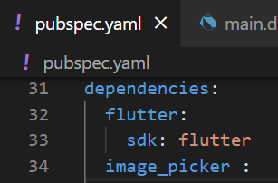
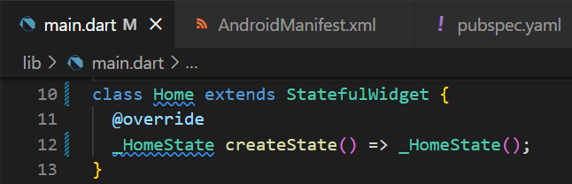
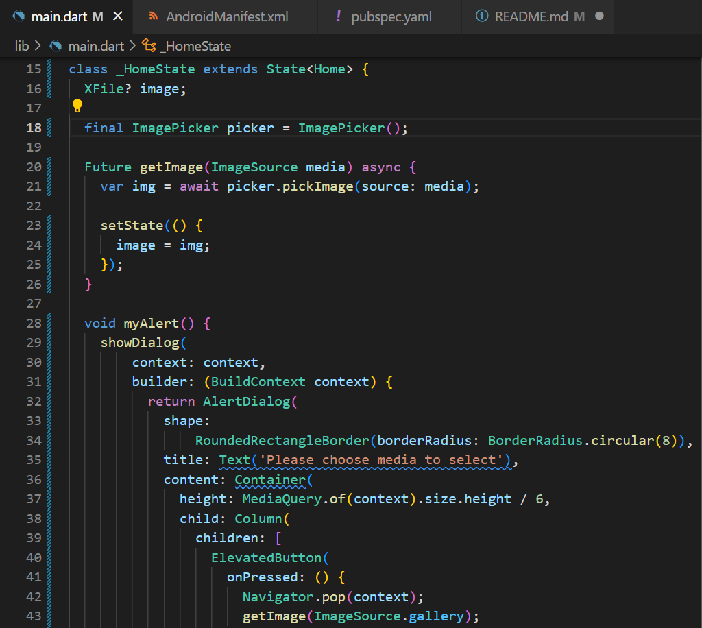
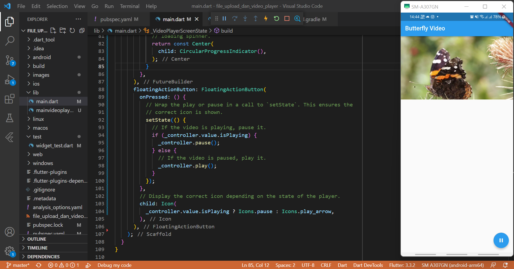
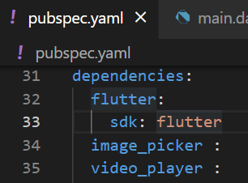
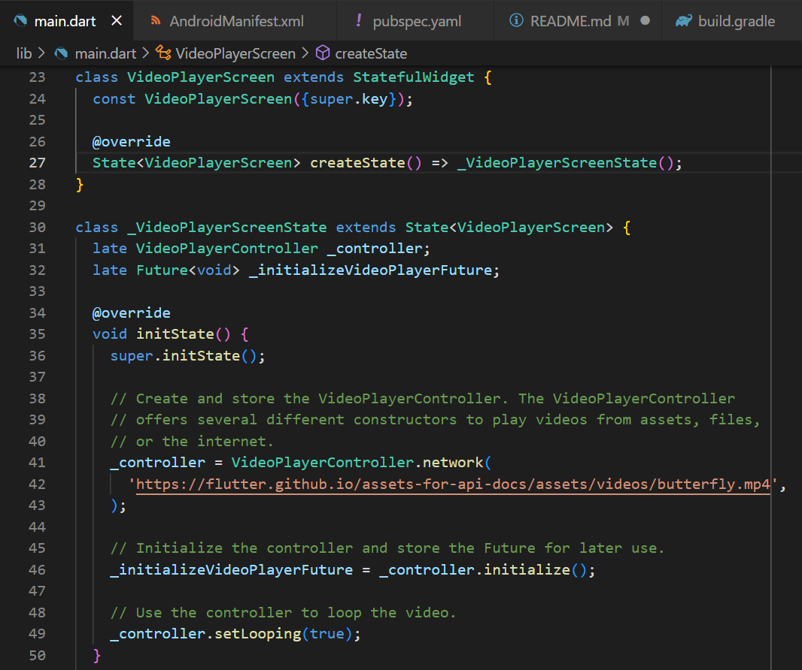
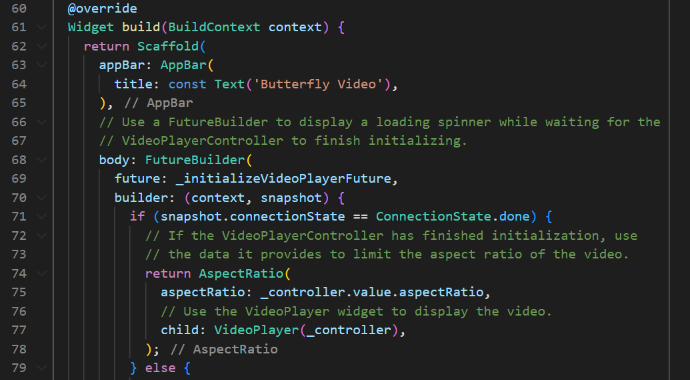
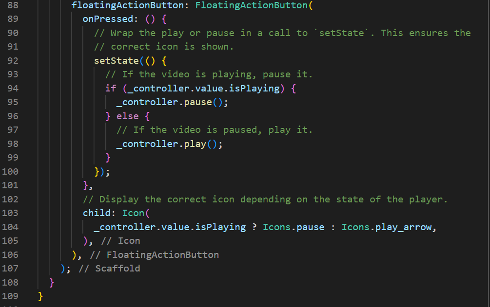

# Laporan Praktikum

## 1. File Upload
- Import library **image_picker** pada **pubspec.yaml**

- Class Home 

- Class _HomeState

.png)
.png)
.png)

- Hasil _running file upload_

## 2. Video Player
- Import _library_ **video_player** pada **pubspec.yaml** 

- Tambahkan _Permission_ untuk melakukan pemutaran video dari internet 

- Membuat dan inisialisasi VideoPlayerController 

.png)

- Menampilkan _video player_

.png)

- Memainkan video

- Hasil _running video player_ 
